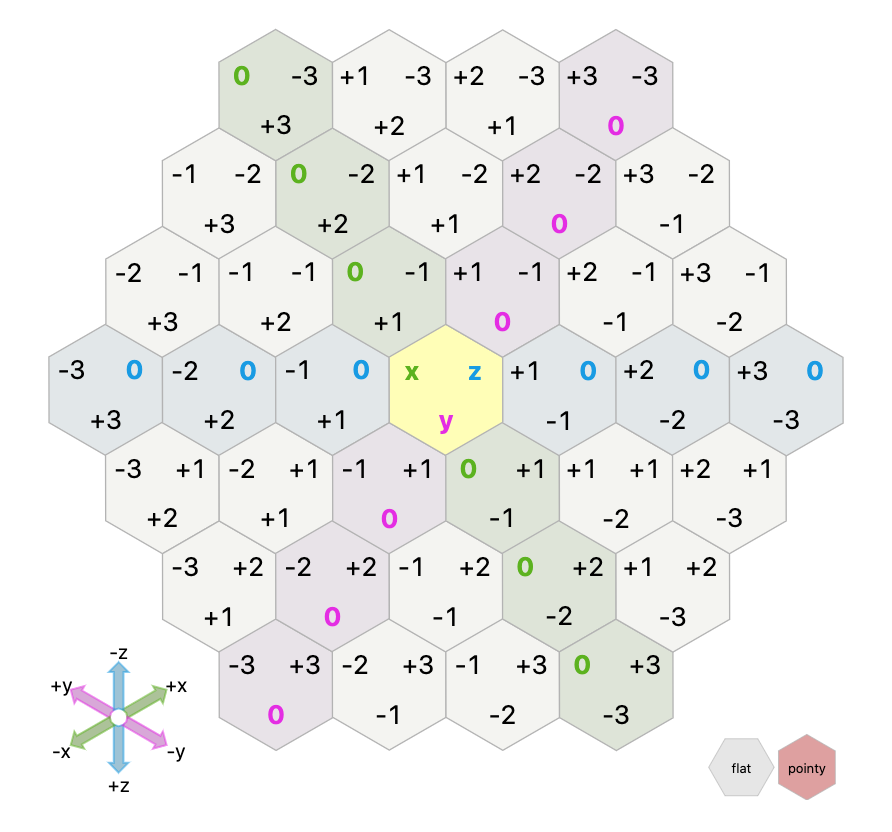

# Advent of Code 2020

These are my solutions to Advent of Code 2020. The solutions are in the `__init__.py` files for each day's package. Sometimes, there is an `alternate` subpackage that has an alternate solution in its own `__init__.py`.

Try the problems yourself at [https://adventofcode.com/2020/](https://adventofcode.com/2020/).

Feel free to create a Github issue if you want to discuss anything!

# Usage

1. Clone this repo: `git clone https://github.com/jkpr/advent-of-code-2020`
2. Change into the new directory: `cd advent-of-code-2020`
3. Run `make env` to build the environment.
4. Activate the environment with `source env/bin/activate`
5. Run a CLI for day `N`'s code with `python3 -m advent.dayN`, e.g. `python3 -m advent.day1`.

The CLI is common for each day. The main patterns for options are:

- `-t` to run part 1 with `test_input.txt`
- `-2` to run part 2
- `-t -2` to run part 2 with `test_input.txt`
- `-t 1` to run part 1 with `test_input1.txt`
- `-t 1 -2` to run part 2  with `test_input1.txt`

# Table of contents

| `Day % 5 == 0` | `Day % 5 == 1` | `Day % 5 == 2` | `Day % 5 == 3` | `Day % 5 == 4` |
| --- | --- | --- | --- | --- |
| | 1 · [_notes_](#day-1) · [_code_](advent/day1) | 2 · [_notes_](#day-2) · [_code_](advent/day2) | 3 · [_notes_](#day-3) · [_code_](advent/day3) | 4 · [_notes_](#day-4) · [_code_](advent/day4) |
| 5 · [_notes_](#day-5) · [_code_](advent/day5) | 6 · [_notes_](#day-6) · [_code_](advent/day6) | 7 · [_notes_](#day-7) · [_code_](advent/day7) | 8 · [_notes_](#day-8) · [_code_](advent/day8) | 9 · [_notes_](#day-9) · [_code_](advent/day9) |
| 10 · [_notes_](#day-10) · [_code_](advent/day10) | 11 · [_notes_](#day-11) · [_code_](advent/day11) | 12 · [_notes_](#day-12) · [_code_](advent/day12) | 13 · [_notes_](#day-13) · [_code_](advent/day13) | 14 · [_notes_](#day-14) · [_code_](advent/day14) |
| 15 · [_notes_](#day-15) · [_code_](advent/day15) | 16 · [_notes_](#day-16) · [_code_](advent/day16) | 17 · [_notes_](#day-17) · [_code_](advent/day17) | 18 · [_notes_](#day-18) · [_code_](advent/day18) | 19 · [_notes_](#day-19) · [_code_](advent/day19) |
| 20 · [_notes_](#day-20) · [_code_](advent/day20) | 21 · [_notes_](#day-21) · [_code_](advent/day21) | 22 · [_notes_](#day-22) · [_code_](advent/day22) | 23 · [_notes_](#day-23) · [_code_](advent/day23) | 24 · [_notes_](#day-24) · [_code_](advent/day24) |
| 25 · [_notes_](#day-25) · [_code_](advent/day25) | | | | |

# Day 1

This is a warm up challenge. Python's standard library comes to the rescue with the [`itertools` library and `combinations` function][1a].

[1a]: https://docs.python.org/3/library/itertools.html#itertools.combinations

# Day 2

Since the lines were all in the same format, a regular expression came to mind. In terms of counting the number of occurrences of a letter, the [`collections.Counter` class][2a] has that functionality built in.

At this point, Python's `itertools` and `collections` modules have been useful, as they often are in programming challenges.

[2a]: https://docs.python.org/3/library/collections.html#collections.Counter

# Day 3

The main thing to realize is that since the forest is repeating along the x-axis, we can use modular arithmetic on the position of the x-axis index.

# Day 4

Some useful things to note.

1. I went with the [`re` module][4a] because the text followed patterns seemingly perfectly.
2. There is a difference in Python between `re.search` (find regex anywhere in the string), `re.match` (find regex starting at the beginning of the string) and `re.fullmatch` (the regex must match the full string). I first did this with `re.match` and a regex like `\d{4}` could match something like `20202`. Of course, there are also the meta characters `^` and `$` to denote the start and end of a line.
3.  The `re` match object has a `.groups()` method which returns just the pieces that match the regex in parentheses `()`. There is also a `.group(n)` method that is similar. `.group(0)` returns the full match, then `1` up to `n` match the pieces matched in parentheses.

[4a]: https://docs.python.org/3/library/re.html

# Day 5

The trick is to realize this is really just binary! I created a string representing a binary number, e.g. 

1. `"BFFFBBFRRR"`
2. `"BFFFBBF"` and `"RRR"`
3. `"1000110"` and `"111"`

Then I used `int(binary_string, base=2)` to convert to integer. The result is 70 and 7. By the way, the reverse operation is 

```python
>>> bin(70)
'0b1000110'
```

I do not have the most elegant solution for part 2, I'm sure. In order to see the gaps, I started with a set of all numbers from 0 to the maximum, then subtracted the set of all seat IDs. Then I printed out what remained as a sorted list and visually (manually) scanned for the correct answer.

# Day 6

Python has some built-in methods that make this one very easy! First of all, it becomes clear that we only need a set of letters per line to test for membership. Python treats a string as an iterable of the individual letters. For example:

```python
>>> set("asdf")
{'a', 's', 'd', 'f'}
```

For part 1, we just need the union of all sets in a group then to count the size. For part 2, we take the intersection, then count the size.

I googled how to take the interection of a collection of sets, and I [found this on StackOverflow][6a]. Basically it is:

```python
set.intersection(*list_of_sets)
```

I am astonished 😲 that this works! The StackOverflow response says:

> Note that `set.intersection` is not a static method, but this uses the functional notation to apply intersection of the first set with the rest of the list. So if the argument list is empty this will fail.

So apparently, that is equivalent to

```python
list_of_sets[0].intersection(*list_of_sets[1:])
```

Same works with `union`. Amazing.

I will need to research this one a little bit more.

[6a]: https://stackoverflow.com/a/2541814/6438168

# Day 7

First recursive algorithm. In trees, we often perform the same function on a node as on its descendents. That is what we did with `get_size` here.

I also made use of [`re.findall(...)`][7a] since rules could have one or more descriptions of bags. The behavior is different when there are 0 or 1 groups vs 2+ groups in the pattern.

```python
>>> import re
>>> line = "bright violet bags contain 1 bright purple bag."
>>> re.findall(r"(\w+ \w+) bag", line)
['bright violet', 'bright purple']
>>> re.findall(r"(\d+ )?(\w+ \w+) bag", line)
[('', 'bright violet'), ('1 ', 'bright purple')]
```

[7a]: https://docs.python.org/3/library/re.html#re.findall

# Day 8

Could this be the first steps to building a compiler? I made some premature optimizations to plan for more op-codes.

# Day 9

A few items of interest:

```python
for STATEMENT:
    ...
else:
    STATEMENT
```

If a `for` loop is not exited via a `break` key word, then an `else` block can be run after the `for` block completes.

Also, [`slice`][9a] objects are useful for getting windows into an array.

[9a]: https://docs.python.org/3/library/functions.html#slice

# Day 10

Part 1 is fairly easy. I made use of `zip` with offset (by 1) lists to get the differences. 

Part 2 was more complicated. In the supplied list of transformers, my breakthrough came when I noticed there were jumps of 1 and 3 only. There are no jumps of 2.

Transformers on both sides of a jump of three have to stay because that is the largest jump allowed, so really I was looking at how to remove transformers that have jumps of 1 from one to the next.

I also noticed that the largest run of jumps of size 1 that I had was 4.

After Googling, I learned
- The number of ways to use 1 and 2 to add up to a number N is the (N+1)-th Fibonacci number
- The number of ways to use 1, 2 and 3 to add up to a number N is the (N+1)-th Tribonacci number.

The [Tribonacci sequence][10a] is 1, 1, 2, 4, 7, 13, 24, 44, 81, ...

So my solution is to identify the number of runs of steps of 1, how long they were, then find the corresponding "Tribonacci number" (I did by hand without knowing the name of the sequence).
Then multiply all those numbers together.

Also: [`itertools.groupby`][10b] came in handy for identifying runs of numbers.
It automatically creates new groups when the value changes, going one item to the next.

[10a]: https://mathworld.wolfram.com/Fibonaccin-StepNumber.html
[10b]: https://docs.python.org/3/library/itertools.html#itertools.groupby

# Day 11

With maze searching, it is easier to list out all the directions as offsets to search rather than name the directions, i.e.

```python
directions = (
    (0, 1),
    (0, -1),
    (1, 1),
    (1, -1),
    (-1, 0),
    (1, 0),
    (-1, 1),
    (-1, -1),
)
```

is better than 

```python
def move_up(...):
    ...

def move_up_right(...):
    ...

... # etc.
```

Also for mazes, I find that working with a single array and doing calculations between index and `(x, y)` is better than maintaining a 2-D array.
These companion functions are helpful. Of course, results can be cached to get even faster, too!

```python
def idx_to_xy(idx, max_x, max_y):
    return divmod(idx, max_y)

def xy_to_idx(x, y, max_x, max_y):
    return x * max_y + y
```

It is easier for me to think in terms of `(x, y)` rather than `row, col`.
In my manner of speaking, I say `row, col` which corresponds to `(y, x)`, so it is opposite to `(x, y)`.
But I almost always think in terms of `(x, y)` and `(x, y)` usually makes more sense for 2-D arrays.

Final thing to say: the neighbors to check in each part do not change from generation to generation.
I decided to cache the neighbors lookup ahead of time with `get_neighbors1` and `get_neighbors2`.
It is much better than calculating them on each pass through.

# Day 12

Fairly straightforward problem. Not too many tricks to share today.
One thing to share is that with Python we can update two values at once.
For example:

```python
# Set x and y at the same time:
x, y = 0, 0

# Perform 180 degree rotation for the problem:
wx, wy = -wx, -wy
```

This makes use of iterable unpacking from tuples.

# Day 13

Part 1 was accomplished by checking and seeing case by case. 

With such a small input file, I could see I had a bus number of 13 (my smallest). So, I would not need to look more than 13 above the start time.

Part 2 was harder. My original solution did not use the Chinese Remainder Theorem. First thing I noticed was that my bus numbers were all prime. I also noticed that a lot of buses would be arriving at the same time. So for that to happen, it had to be a multiple of the product of all of those buses. I did a "brute force" search on that multiple. 

But the Chinese Remainder Theorem was definitely the way to go to immediately calculate an answer.

Calculate the product of an iterable of numbers with [math.prod][13a]:

```python
import math

nums = [3, 5, 6]
result = math.prod(nums)  # 90
```

Also there is a difference between `/` and `//`:

```python
>>> 10 / 2
5.0
>>> 10 // 2
5
```

The first (`/`) is float division and the second (`//`) is integer division.

[13a]: https://docs.python.org/3/library/math.html#math.prod

# Day 14

My previous notes on converting between base 10 and base 2 were helpful here!

A number saved as a string, e.g. `"42"`, can be padded with zeros using `.zfill(width)`. See [`zfill` documentation][14a].

```python
>>> "42".zfill(5)
"00042"
```

The cartesian product also came in handy for the second part to fill in the `X` values in the memory mask. See documentation for [`itertools.product`][14b].

```python
>>> for i in itertools.product([0, 1], repeat=3): print(i)
(0, 0, 0)
(0, 0, 1)
(0, 1, 0)
...
(1, 1, 1)
```

Thanks to [Chris Freeman][14c], I learned an alternate way to "convert a number to binary and left pad it with zeros". 
This makes use of the [String Format Specification Mini-Language][14d]. This string formatting language is quite powerful, and it can do a lot.

```python
>>> value = 100
>>> width = 36
>>> binary = f"{value:0{width}b}"
>>> binary
'000000000000000000000000000001100100'
>>> int(binary, base=2)
100
```

[14a]: https://docs.python.org/3/library/stdtypes.html#str.zfill
[14b]: https://docs.python.org/3/library/itertools.html#itertools.product
[14c]: https://teamtreehouse.com/chrisfreeman3
[14d]: https://docs.python.org/3/library/string.html#formatspec

# Day 15

I first took the approach of 

- "Given I am on turn `i`, what number should I be?" 

What was easier to answer and faster for the code was:

- "Given I am on turn `i` and I already know what number I should have, what number should be for turn `i+1`?"

For the first approach, I needed to keep track of previous two positions using a list / deque (part 2 ran in 45 seconds). 
But for the second approach, I could keep track of the previous position alone (part 2 ran in 15 seconds).

One helpful assumption / discovery: the first number after going through the input is 0 because the input numbers are all unique. 
That is true for my puzzle input and for all the examples.

# Day 16

I will first describe my alternate solution, which uses `numpy` arrays.

## Day 16, Part 1, numpy solution (alternate)

The first task is to make a numpy array out of the string input, e.g. `"3,9,18"`. For that we can use [`numpy.fromstring`][16a]:

```python
>>> import numpy as np
>>> s = "3,9,18"
>>> np.fromstring(s, dtype=int, sep=",")
array([ 3,  9, 18])
```

[16a]: https://numpy.org/doc/stable/reference/generated/numpy.fromstring.html

Next, I wanted to convert my list of arrays representing the "nearby tickets", to a 2-D numpy array. That is done with [`numpy.stack`][16b] (the more specialized [`numpy.vstack`][16c] would have worked, too).

```python
nearby = np.stack(list_of_arrays)
```

[16b]: https://numpy.org/doc/stable/reference/generated/numpy.stack.html
[16c]: https://numpy.org/doc/stable/reference/generated/numpy.vstack.html

This puts each line from the puzzle input as a row in the 2-D array. In other words, `nearby[i]` returns the numpy array for the _i_-th row. That concludes data ingest. 

The next goal is to create a "cube" (`the_cube` in the code). This is a 3-D array where the 2-D array for neighbor tickets (I imagine it as the XY plane) is replicated for each rule (think: the Z axis) in the rules. Each entry in each replicant is transformed to True / False depending on if the value fits in the rule's range.

Integral to this is [`numpy.isin`][16d], the element-wise version of Python's `in`. Since the values in the rules dictionary are sets (representing valid integer ranges), they need to be converted to a list for this to work correctly. Thank you, documentation 💪!

```python
axis0 = sorted(rules)  # The keys (fields) from the rules dictionary.
the_cube = np.stack([
    np.isin(nearby, list(rules[item])) for item in axis0
])
```

Also, note that stacking joins the arrays along a new axis, and that is axis 0 by default. Or, in summary,

- Axis 0 of the cube represents the rules, e.g. `class: 0-1 or 4-19`
- Axis 1 of the cube represents the individual nearby tickets
- Axis 2 of the cube represents the columns of the nearby tickets

A given entry `(i, j, k)` in `the_cube` is True if nearby ticket `j`, column `k`, fits in the range for rule / field `i`.

[16d]: https://numpy.org/doc/stable/reference/generated/numpy.isin.html

Now, for part 1, we need to create a 2-D boolean mask, matching `nearby` in shape. We want to take the 1-D array `the_cube[:, j, k]` for a particular `j` and `k`, see if any elements are True, then negate it (to be True if all array elements are False). With the `:` for axis 0, we get the array across all rules. This is done with [`numpy.any`][16e]. Then we apply that mask to the original `nearby` matrix and sum the elements for our answer to Part 1.

```python
mask = ~np.any(the_cube, axis=0)
return np.sum(nearby[mask])
```

[16e]: https://numpy.org/doc/stable/reference/generated/numpy.any.html

## Day 16, Part 2, numpy solution (alternate)

We get the cube again, and the first task is to remove the "bad" rows (defined as nearby tickets on which all entries do not fit any rule) from each 2-D array of nearby tickets. 

```python
row_mask = np.all(np.any(the_cube, axis=0), axis=1)
good_cube = the_cube[:, row_mask, :]
```

The result of the inner `np.any` matches the 2-D array of nearby tickets, asking if an entry at `j, k` has a True value anywhere along the Z-axis (axis 0). Then `np.all` is True for the rows (new axis 0) where all entries along axis 1 are True. We apply that `row_mask` to axis 1 of `the_cube` to get the `good_cube`.

Now we enter the end game. We create "mutable" 2-D arrays

```python
field_by_col = np.all(good_cube, axis=1)
solution = np.zeros(field_by_col.shape, dtype=bool)
```

The array `field_by_col` is a 2-D array where the rows represent the rules, and the columns represent the columns of the nearby tickets. An entry `(field, col)` is True if all entries along `(field, :, col)` are True. 

The `solution` 2-D array is initialized to False, and eventually will have one True per row, such that an entry `(field, col)` is True if we know that `col` should match `field`.

Both of these arrays are square since the number of fields matches the number of columns.

We are finally approaching a solution, now! 

In the example of

```
class: 0-1 or 4-19
row: 0-5 or 8-19
seat: 0-13 or 16-19

your ticket:
11,12,13

nearby tickets:
3,9,18
15,1,5
5,14,9
```

we have `field_by_col` as

```python
array([[False,  True,  True],
       [ True,  True,  True],
       [False, False,  True]])
```

The rows / fields are ordered as `array(['class', 'row', 'seat'], dtype='<U5')`. Right away, we can see that `seat` only has one possible option: column 2 (0-indexed). We iterate the following steps until we are done:

```python
fields_solved = np.sum(field_by_col, axis=1) == 1
# On first iteration, fields_solved is array([False, False,  True])
columns_solved = np.sum(field_by_col[fields_solved, :], axis=0) == 1
# On first iteration, columns_solved is array([False, False,  True])
solution[fields_solved, columns_solved] = field_by_col[
    fields_solved, columns_solved
]
field_by_col[:, columns_solved] = False
```

1. The first calculation `fields_solved` shows the rows that we know a solution (with exactly one True). Then `columns_solved` shows the columns that are solved (it must be summed over axis 0 because there could be multiple fields/columns solved at once).
2. Next, `solution` is updated with the fields and columns that were solved. On the first iteration, `solution` goes from a 2-D array of all False to:

```python
array([[False, False, False],
       [False, False, False],
       [False, False,  True]])
```

3. Finally, everything in the solved fields and columns of `field_by_col` is set to False. At the end of the first iteration, `field_by_col` is:

```python
array([[False,  True, False],
       [ True,  True, False],
       [False, False, False]])
```

and we can see that in the next iteration the rule `class` must match column 1 (0-indexed).

The iteration repeats until everything in `field_by_col` is set to False. In the example, our final `solution` is:

```python
array([[False,  True, False],
       [ True, False, False],
       [False, False,  True]])
```

To finish out part 2, we simply get the right indices using [`numpy.char`][16f] (for access to vectorized string functions).

```python
idx = np.any(solution[np.char.startswith(axis0, "departure")], axis=0)
return np.prod(mine[idx])
```

[16f]: https://numpy.org/doc/stable/reference/routines.char.html

## Day 16, standard Python approach

At first, I used ranges to represent the rule. So for example, `class: 1-3 or 5-7` becomes

```python
{
    "class": [range(1, 4), range(5, 8)]
}
```

But then I switched to sets, so that the above becomes:

```python
{
    "class": {1, 2, 3, 5, 6, 7}
}
```

This change simplified things a little bit.

A separate issue, now. It is common to have a list of rows, e.g.

```python
m = [
    [0, 1, 2],
    [3, 4, 5],
]
```

Iterating over the rows is easy: `for row in m: ...`. Now how to iterate over columns? Use `zip`!

```python
for col in zip(*m):
    ...
```

# Day 17

Fun to play another Conway game. This time I made copious use of `defaultdict`. 
The default value is 0 for `.` and value of 1 for `#`. 
Neighbors were obtained using the cartesian product of `[-1, 0, -1]` in 3 or 4 dimensions as an offset.

I refactored the code so that it will work in any number of dimensions >= 3.

## Day 17, numpy solution (alternate)

Instead of going line by line, I'll just note the interesting functions here:

1. [`numpy.exand_dims()`][17a] to add dimensions to an array.

```python
>>> import numpy as np
>>> x = np.array([1, 2])
>>> np.expand_dims(x, axis=(0,))
array([[1, 2]])
```

2. [`numpy.ones()`][17b] to create an array filled with ones.

```python
>>> ones = np.ones(shape=(3,3), dtype=int)
>>> ones
array([[1, 1, 1],
       [1, 1, 1],
       [1, 1, 1]])
```

3. [`numpy.pad`][17c] to add padding around the original array. This is needed in the problem because the Conway Cube can grow out in every direction. The default is to pad with 0.

```python
>>> padded = np.pad(ones, 1)
>>> padded
array([[0, 0, 0, 0, 0],
       [0, 1, 1, 1, 0],
       [0, 1, 1, 1, 0],
       [0, 1, 1, 1, 0],
       [0, 0, 0, 0, 0]])
```

4. [scipy.ndimage.convolve][17d] to perform a convolution. This applies a kernel, or a function, at each point in the original array. Photo blurring is a convoluton using a normal kernel (taking a weighted average of all neighbors).

```python
>>> kernel = np.array([[0, 1, 0], [1, 0, 1], [0, 1, 0]])
>>> kernel
array([[0, 1, 0],
       [1, 0, 1],
       [0, 1, 0]])
>>> scipy.ndimage.convolve(padded, kernel)
array([[0, 1, 1, 1, 0],
       [1, 2, 3, 2, 1],
       [1, 3, 4, 3, 1],
       [1, 2, 3, 2, 1],
       [0, 1, 1, 1, 0]])
```

[17a]: https://numpy.org/doc/stable/reference/generated/numpy.expand_dims.html
[17b]: https://numpy.org/doc/stable/reference/generated/numpy.ones.html
[17c]: https://numpy.org/doc/stable/reference/generated/numpy.pad.html
[17d]: https://docs.scipy.org/doc/scipy/reference/generated/scipy.ndimage.convolve.html

# Day 18

This brought me back to my data structures and algorithms class. The solution is simply a standard implementation of the [Shunting-yard algorithm][18a].

After part 2 was completed, I refactored so that the operator precedence is taken into account in order to reuse code.

[18a]: https://en.wikipedia.org/wiki/Shunting-yard_algorithm

## Day 18, AST solution (alternate)

This solution uses the AST to get the precedence correct after swapping operators.

For Part 1, I replaced `*` with `-` so that the operators would have the same precedence. Then after parsing the abstract syntax tree, I replaced `Sub` nodes with `Mult` nodes.

It was somewhat difficult to get a value out of an `exec` / AST combo. I had to give `globals()` as an argument to exec.

```python
tree = ast.parse(f"this_result = {line.replace('*', '-')}")
code = compile(tree, filename="<ast>", mode="exec")
exec(code, globals())
print(this_result)  # does not raise NameError.
```

Part 2 was only a little more complicated because I had to swap the precedence of the operators. So

1. `*` -> `-`
2. `+` -> `*`
3. Parse AST
4. Make substitutions
5. Compile and execute!

Important resources are:

- [Python `ast` module documentation][18a]
- [Green Tree Snakes][18b], how to actually do stuff with AST
- [Stack overflow answer about `exec`][18c]

[18a]: https://docs.python.org/3/library/ast.html
[18b]: https://greentreesnakes.readthedocs.io/en/latest/index.html
[18c]: https://stackoverflow.com/a/52013194/6438168

# Day 19

My first thought was to build a regex by parsing out all possible rules. However, with the introduction of loops in part 2, that was no longer possible.

I rewrote the code to be a recursive matcher. It recursively descends by substituting a higher-order rule with that rule expanded. This handles the Part 2 rule modifications perfectly with no changes.

# Day 20

For the first time during this advent calendar, I have written a class to represent the individual tiles of the image. 
One thing to say about the Object Oriented Programming: try not to have multiple properties describe the same state of the object.
In my first attempt, I manipulated the tile contents and also kept track of the flip and rotate status.
In my second (and better) attempt, I kept track of the flip and rotate status while keeping the original tile contents as they were.
When I needed the contents in the current state, I applied the flips and rotates then returned the contents.

One interesting thing is [`itertools.chain()`][20a]. In the end I had a list of String objects, and I needed to count the number of `"#"` characters in those String objects. Instead of a standard:

```python
lines = [
    "..#..##.",
    "...###.#",
    ".###....",
]
count = 0
for line in lines:
    for ch in line:
        if ch == "#":
            count += 1
```

I can chain together all the lines into a single iterator:

```python
count = sum(ch == "#" for ch in itertools.chain(*lines))
```

The chain exhausts each iterator argument in sequence.

[20a]: https://docs.python.org/3/library/itertools.html#itertools.chain

# Day 21

Nothing too fancy going on here. Just need to understand the problem first.

# Day 22

This is a good time to bring up Python 3.8's "[walrus operator][22a]" (`:=`).

In Day 22, I have used it as

```python
...
if (state := (tuple(deck1), tuple(deck2))) in seen:
    deck2.clear()
    return deck1, deck2
seen.add(state)
...
```

Here is important to note the priority of the operator. The enclosing parentheses are necessary because the walrus operator has very low precedence. Only the comma has lower, according to PEP-572.

So these all have different results for `state`:

```python
(state := (tuple(deck1), tuple(deck2))) in seen  ## state is a tuple of two tuples
(state := tuple(deck1), tuple(deck2)) in seen  ## state is tuple(deck1)
state := (tuple(deck1), tuple(deck2)) in seen  ## state is True / False
```

So far, I have mostly seen the walrus operator used to improve situations where we create an object from a statement and perform a boolean test on it. For example

```python
env_base = os.environ.get("PYTHONUSERBASE", None)
if env_base:
    return env_base
```

becomes

```python
if env_base := os.environ.get("PYTHONUSERBASE", None):
    return env_base
```

[22a]: https://www.python.org/dev/peps/pep-0572/

# Day 23

For this problem, I create a dictionary where the key is a member / cup, and the value is the member / cup that is next to it.

In order to get the next N items after a given cup, we need to do something like (`cups` is our dictionary, and `cup` is the starting cup):

```python
cups[cup]
cups[cups[cup]]
cups[cups[cups[cup]]]
...
cups[...[cups[cups[cup]]]]
```

What is the pythonic way to do this? We can use `itertools`!


```python
itertools.islice(
    itertools.accumulate(
        itertools.repeat(None),
        lambda x, _: cups[x],
        initial=cups[cup]
    ), N
)
```

Here, [`itertools.islice()`][23a] is used to get the next `N` items of an iterator (the accumulate iterator). This is "taking" the next `N` items of the iterator.

Next, [`itertools.accumulate()`][23b] starts with `cups[cup]` (the `initial` key word argument), then uses the lambda function to get the next item in the sequence. The function in `accumulate` should take two arguments: the first is the stored / accumulated results; the second is the next item from the supplied iterator. In this case, we ignore the second argument.

Finally, `itertools.repeat(None)` is just an iterator that never ends. It repeates `None` indefinitely.

[23a]: https://docs.python.org/3/library/itertools.html#itertools.islice
[23b]: https://docs.python.org/3/library/itertools.html#itertools.accumulate
[23c]: https://docs.python.org/3/library/itertools.html#itertools.repeat

# Day 24

Once I got the right coordinate system, this one was not too difficult. Thank you, [redblobgames.com][24a], for the following graphic. 



There are three axes, `x`, `y`, and `z`, and the constraint is that `x+y+z = 0`. Moving to an adjacent hexagon increases one coordinate by one and decreases a different coordinate by one.

To solve the problem, I kept track of coordinates, just the same as in a square.

[24a]: https://www.redblobgames.com/grids/hexagons/#coordinates-cube
